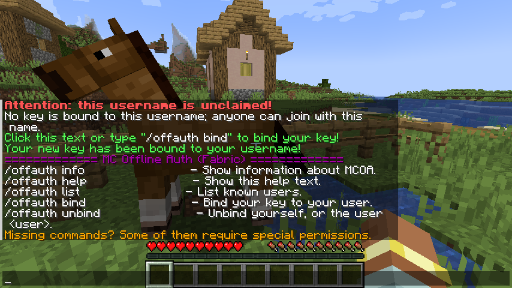

# MCOfflineAuth4Forge

---
Basic authentication mod for servers.

**This is the forge version. Only client-side functionality is supported.**

For the full guide, check out the [original version](https://github.com/a455jldvmsrwll1a/MCOfflineAuth) (Fabric).

## Dependencies

- [Minecraft 1.21.4](www.minecraft.net)
- [Forge](https://files.minecraftforge.net/net/minecraftforge/forge/).

## Installation

**Just need to download the mod? You can use the precompiled binaries which can be found in the [Releases](https://github.com/a455jldvmsrwll1a/MCOfflineAuth4Forge/releases) section.**

**(Work in Progress)** Building from source:

1. Clone the repository and enter the project directory.
2. Run `./gradlew build` on Linux/Mac and `.\gradlew.bat build` on Windows.
3. Run `./gradlew jarJar` on Linux/Mac and `.\gradlew.bat jarJar` on Windows.
4. Hopefully it should build just fine.
5. The compiled JAR can be found in `build/libs/mcofflineauth-*-all.jar` (without the `-sources`).

## Usage (Players)

**You can do `/offauth help` for available commands.**

In most cases, it is extremely simple:

1. [Install](#installation) the mod.
2. Join a server (with the  mod installed).
3. Click the prompt when you log-on or run `/offauth bind`
4. Done.

*Got kicked?* The server can be set to reject users without a key already bound. In this case, an admin needs to bind you in advance.

1. Click the **OA** button in the main menu.
2. If there is no button, you can access it through the **Config** button in the mods list.
3. Click the long button with the key to copy the key.
4. Share this key to an admin of the server.
5. Join the server.

#### Unbinding

To unbind, you can do `/offauth unbind`.

## Configuration

The mod creates and uses files in its own `.offline-auth` directory, located within `.minecraft`.

The client will create and read the files `secret-key` and `public-key` to store the keypair.

## Licence

[MIT](LICENSE.txt)
